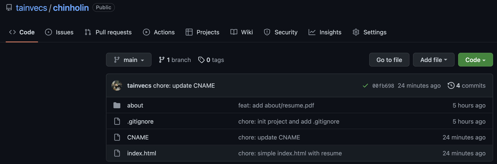
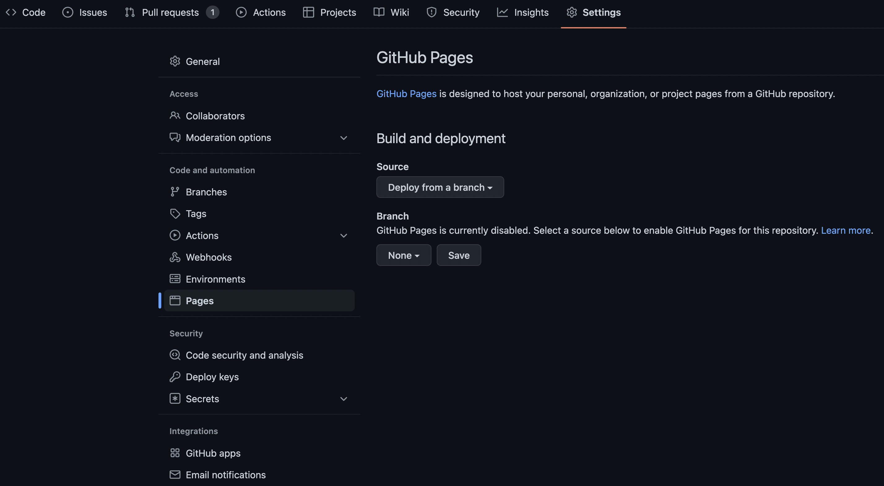
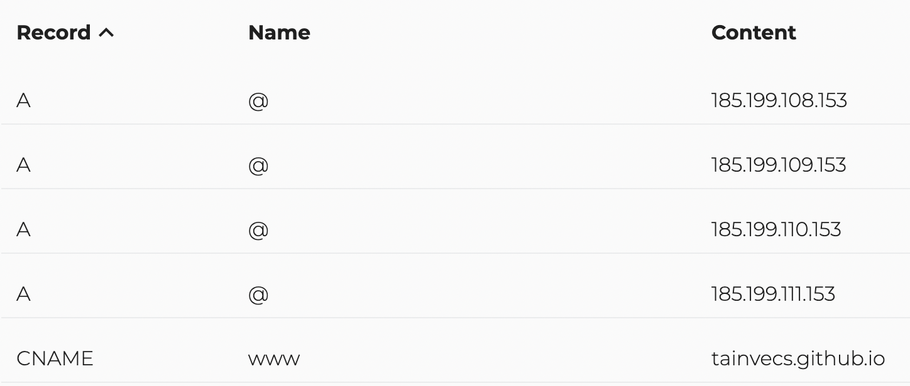
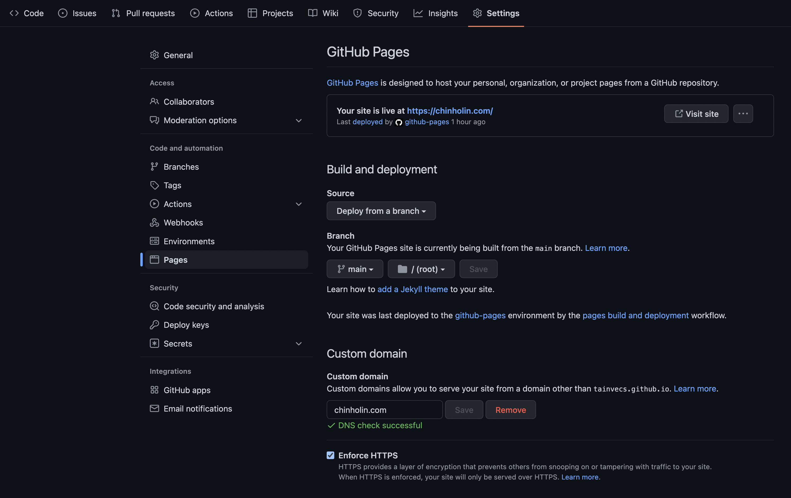
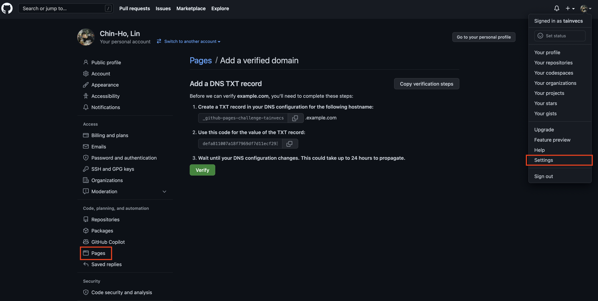

This article will start from scratch to display your resume pdf file on the GitHub Pages site.
We can split the approach into 3 main steps.  <!--truncate-->
The third step is optional and will go through how to update DNS, enable HTTPS, verify the custom domain, and use a custom domain for GitHub Pages.
The codes and files for this article are available at this [GitHub Repo](https://github.com/tainvecs/chinholin/tree/b38c5cdabd5c20272420ef258fc61fccf5fcee59).


### Steps {#contents-of-steps}
- **Step 1: Open a New Repository**
  - Open a New Public repository
  - Upload Your Resume PDF File
  - Create an `index.html`
- **Step 2: Build and Deploy Your GitHub Pages Site**
- **Step 3: (Optional) Use Your Custom Domain**
  - Update DNS
  - Enforce HTTPS
  - Verify Your Custom Domain


## **Step 1: Open a New Repository** {#open-a-new-repository}



### **Open a New Public repository** {#new-repository}
- I opened a new public repo `chinholin` for the GitHub Pages site.
- The `CNAME` file will be created by the Github Pages if you use your custom domain. You can ignore the file for now.
- The `.gitignore` file is optional.

### **Upload Your Resume PDF File** {#upload-resume-pdf}
- I uploaded my resume `resume.pdf` to an `about` folder.

### **Create an index.html** {#create-an-index-html}
- I referenced [this blog](https://jai-dewani.github.io/blogs/one-stop-solution-to-sharing-your-resume/) and added a simple `index.html` to the repo.
```html
<!DOCTYPE html>
<html lang="en">
<head>
    <meta http-equiv="content-type" content="text/html; charset=utf-8">
    <meta http-equiv="X-UA-Compatible" content="IE=edge">
    <meta name="viewport" content="width=device-width, initial-scale=1.0">
    <title>Resume - Chin-Ho Lin</title>
    <style type="text/css">
        *{
            border:0;
            margin:0;
        }
    </style>
</head>
<body>
    <div style="height: 100vh;">
        <iframe src="https://tainvecs.github.io/chinholin/about/resume.pdf" width="100%" height="100%"></iframe>
    </div>
</body>
</html>
```
- You can update the `<title>` and the link in `<iframe>`.
- The link follows the format of `"https://<username>.github.io/<repo-name>/<path-to-resume-pdf-file>"` or simply right click the `resume.pdf` file and copy link address.


## Step 2: Build and Deploy Your GitHub Pages Site {#github-pages}



- **Go to `Settings/Pages` of the newly created repository.**
- **Build and Deploy Your GitHub Pages Site**
  - Select `main` branch and save to enable GitHub Pages.
  - By default, your GitHub Pages site will be available at `https://<username>.github.io/<github-repo>`.
  - In addition, your resume pdf file is at `https://<username>.github.io/<github-repo>/about/resume.pdf`.
  - In this example, the resume pdf is at `https://tainvecs.github.io/chinholin/about/resume.pdf`.


## Step 3: (Optional) Use Your Custom Domain {#use-your-custom-domain}

In this article, I will use `chinholin.com` as the custom domain.
If you are using a subdomain `blog.example.com`, you can reference the instruction here [Configuring a subdomain](https://docs.github.com/en/pages/configuring-a-custom-domain-for-your-github-pages-site/managing-a-custom-domain-for-your-github-pages-site#configuring-a-subdomain).

### **Update DNS** {#update-dns}



- By referencing [Configuring an apex domain](https://docs.github.com/en/pages/configuring-a-custom-domain-for-your-github-pages-site/managing-a-custom-domain-for-your-github-pages-site#configuring-an-apex-domain), I added new `A` records.

- In addition, as the recommendation from [Configuring an apex domain and the www subdomain variant](https://docs.github.com/en/pages/configuring-a-custom-domain-for-your-github-pages-site/managing-a-custom-domain-for-your-github-pages-site#configuring-an-apex-domain-and-the-www-subdomain-variant) and avoiding the issue discussed in https://github.com/isaacs/github/issues/1675, I also added a `CNAME` record to point `www.chinholin.com` to `tainvecs.github.io`.

- The DNS can take a few minutes to a few hours. The GitHub documentation also gives a heads up.
  > **Note:** DNS changes can take up to 24 hours to propagate.

- Confirm your DNS record is configured correctly
  - You can use this command to check if the primary domain `chinholin.com` is configured correctly
    ```bash
    dig chinholin.com +noall +answer -t A
    ```

  - You will see the result like
    ```bash
    ; <<>> DiG 9.10.6 <<>> chinholin.com +noall +answer -t A
    ;; global options: +cmd
    chinholin.com.		3600	IN	A	185.199.109.153
    chinholin.com.		3600	IN	A	185.199.111.153
    chinholin.com.		3600	IN	A	185.199.108.153
    chinholin.com.		3600	IN	A	185.199.110.153
    ```

  - Try this command to check if the `CNAME` record for `www.chinholin.com` is configured correctly
    ```bash
    dig [www.chinholin.com](http://www.chinholin.com/) +nostats +nocomments +nocmd
    ```

  - The result
    ```bash
    ; <<>> DiG 9.10.6 <<>> www.chinholin.com +nostats +nocomments +nocmd
    ;; global options: +cmd
    ;www.chinholin.com.		IN	A
    www.chinholin.com.	3600	IN	CNAME	tainvecs.github.io.
    tainvecs.github.io.	3600	IN	A	185.199.109.153
    tainvecs.github.io.	3600	IN	A	185.199.111.153
    tainvecs.github.io.	3600	IN	A	185.199.110.153
    tainvecs.github.io.	3600	IN	A	185.199.108.153
    ```

### **Enforce HTTPS** {#enforce-https}
  - Update the “Custom Domain” field. Wait for DNS configuration to take effect, and the DNS check will success.
  - After the DNS check success, you can enable HTTPS by clicking the checkbox `Enforce HTTPS`.
  

### **Verify Your Custom Domain** {#verify-your-custom-domain}
  - Go to your account `settings/Pages` and click on `add a domain` button.
  - Then, you need to add a DNS `TXT` record to verify your domain.
  - From [About domain verification for GitHub Pages](https://docs.github.com/en/pages/configuring-a-custom-domain-for-your-github-pages-site/verifying-your-custom-domain-for-github-pages#about-domain-verification-for-github-pages), we know why we need to verify the domain.

  > Verifying your domain stops other GitHub users from taking over your custom domain and using it to publish their own GitHub Pages site.

  


# Reference

- [Your one stop solution to sharing your resume with everyone](https://jai-dewani.github.io/blogs/one-stop-solution-to-sharing-your-resume/)
- [Managing a custom domain for your GitHub Pages site](https://docs.github.com/en/pages/configuring-a-custom-domain-for-your-github-pages-site/managing-a-custom-domain-for-your-github-pages-site#configuring-an-apex-domain)
- [Configuring an apex domain and the www subdomain variant](https://docs.github.com/en/pages/configuring-a-custom-domain-for-your-github-pages-site/managing-a-custom-domain-for-your-github-pages-site#configuring-an-apex-domain-and-the-www-subdomain-variant)
- [GitHub Pages: Generate SSL certificate for www subdomain when a custom domain is set to an apex (and vice versa)](https://github.com/isaacs/github/issues/1675)
- [How can I get GitHub pages to give a correct SSL certificate for my www subdomain](https://stackoverflow.com/questions/67043175/how-can-i-get-github-pages-to-give-a-correct-ssl-certificate-for-my-www-subdomai)
- [About domain verification for GitHub Pages](https://docs.github.com/en/pages/configuring-a-custom-domain-for-your-github-pages-site/verifying-your-custom-domain-for-github-pages#about-domain-verification-for-github-pages)
- [Vecteezy PDF Logo](https://www.vecteezy.com/vector-art/3399479-modern-flat-design-of-pdf-file-icon-for-web)
